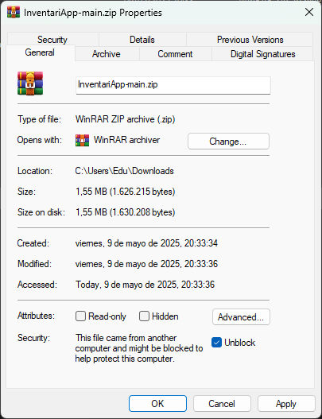

# Continuació de la prova tècnica

### Preguntes 5 i 6

> 5. Implementa una API REST que permita realizar operaciones CRUD
>    (crear, leer, actualizar y eliminar) sobre la entidad de Inventario.

> 6. (Opcional) Implementa una pantalla utilizando .NET Framework y
>    ASP.NET que muestre una tabla con filtros para visualizar los datos
>    obtenidos desde la API desarrollada en el punto anterior. Como
>    referencia visual, se adjunta una captura de pantalla que puede servir de
>    inspiración. La implementación y diseño quedan a tu criterio, y se
>    valorará positivamente la creatividad y el esfuerzo invertido en esta
>    tarea.

Per el desenvolupament d'aquestes dues preguntes, he preferit fer-ho en un repositori diferent.

He fet servir `SQLite` i `EntityFramework` pel tractament de dades, partint del template de Visual Studio `ASP.NET Core Web App (Mode-View-Controller)` [`Bootstrap`](https://getbootstrap.com/) i pels estils (CSS).

Si feu una descàrrega del ZIP, tingueu en compte que potser haureu de marcar l'opció `Unblock` abans d'extreure els fitxers.

Un cop dins de la carpeta, busqueu l'arxiu `InventariApp.sln` i allà ho tindreu tot!
